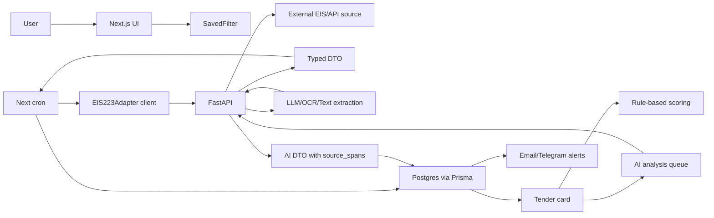

# Architecture blueprint

## Принцип разделения сервисов

MVP состоит из двух приложений:

- `apps/web` - Next.js App Router, system of record, UI, auth, Prisma, бизнес-состояние, cron routes, alerts.
- `apps/api` - FastAPI, stateless compute/adaptation service для внешнего источника, нормализации, парсинга документов и AI.

PostgreSQL пишет только Next.js через Prisma. FastAPI не использует ORM для бизнес-таблиц и не мутирует состояние продукта.

## Поток данных



## Рекомендуемая структура

```text
apps/web
  app/(app)/watchlists/page.tsx
  app/(app)/tenders/page.tsx
  app/(app)/tenders/[id]/page.tsx
  app/(app)/board/page.tsx

  app/api/auth/[...nextauth]/route.ts
  app/api/cron/watchlists/run/route.ts
  app/api/cron/analysis/run/route.ts
  app/api/cron/alerts/run/route.ts
  app/api/telegram/webhook/route.ts
  app/api/files/[documentId]/route.ts
  app/api/healthz/route.ts

  src/actions/watchlists.ts
  src/actions/tenders.ts
  src/actions/kanban.ts
  src/actions/checklists.ts
  src/actions/analysis.ts

  src/lib/prisma.ts
  src/lib/auth.ts
  src/lib/validators/
  src/lib/clients/fastapi.client.ts
  src/lib/adapters/eis223.adapter.ts
  src/lib/scoring/bidNoBid.ts
  src/lib/alerts/

apps/api
  app/main.py
  app/routers/eis223.py
  app/routers/documents.py
  app/routers/ai.py
  app/services/provider_gosplan.py
  app/services/pdf_extract.py
  app/services/ocr_fallback.py
  app/services/prompting.py
  app/schemas/
```

## Архитектурные инварианты

### DB ownership

Next.js:

- создает и обновляет `Tender`, `Document`, `AIAnalysis`, `SavedFilter`, `KanbanStage`;
- валидирует DTO от FastAPI;
- делает idempotent upsert;
- отвечает за ownership и authz.

FastAPI:

- принимает request DTO;
- ходит во внешний источник;
- нормализует raw payload;
- извлекает текст из документов;
- вызывает OCR/LLM;
- возвращает response DTO;
- не знает о текущем пользователе кроме переданного контекста запроса.

### Source state vs work state

`sourceStage` выводится из документов и дедлайнов источника. `kanbanStageId` показывает внутренний процесс команды. Автоматическое изменение внутреннего канбана запрещено в MVP, кроме ненавязчивых suggestions.

### Idempotency

Все фоновые операции должны быть безопасны при повторном запуске:

- watchlist run использует stable key: `[userId, externalPurchaseId, lotNumber]`;
- alert run использует `idempotencyKey`;
- AIAnalysis использует `kind + inputHash + promptVersion`;
- Document использует `externalDocumentId`, `sourceHash` или fallback checksum.

### Observability

Минимальные события для логов:

- `watchlist.run.started`;
- `watchlist.run.completed`;
- `tender.upserted`;
- `document.metadata.changed`;
- `document.extract.failed`;
- `ai.analysis.completed`;
- `ai.analysis.failed`;
- `alert.sent`;
- `alert.skipped_duplicate`;
- `cron.locked`;
- `cron.failed`.

## ADR: выбранный стек

Решение: Next.js + Prisma + PostgreSQL + FastAPI.

Причины:

- Next.js удобно держит UI, auth, mutations и cron routes рядом с бизнес-логикой.
- Prisma дает типизированную схему и JSONB для гибридной модели 223-ФЗ.
- FastAPI хорошо подходит для адаптеров, OpenAPI-контрактов, parsing и AI.
- PostgreSQL закрывает relational queries, дедлайны, индексы и JSONB-тени raw payload.

Последствия:

- нельзя писать в БД из FastAPI;
- нужна строгая DTO-валидация на границе;
- нужен contract test между Next.js client и FastAPI OpenAPI.

